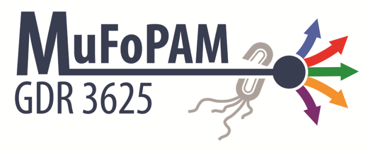

GDR3625
=======

A Symfony project created on September 27, 2016, 11:03 am.

# 

## Installation

Pour l'installation du site :
* Sur le terminal du serveur :
 -> Se mettre dans le dossier choisit
 -> git clone https://github.com/WildCodeSchool/orleans-0916-mufopam.git
 -> composer install
 -> rentrer les informations de la base de donnée et du mail
 -> Donner les autorisation au dossier app/cache et app/logs : chmod -R 777 app/cache app/logs

## API

##### css

##### script

##### cookies

###### Tip

##### filename

##### selector

##### hide

##### username

##### password

##### scale

##### format

##### userAgent

##### headers

### pageres.src(url, sizes, options)

#### url

#### sizes

#### options

### pageres.dest(directory)

#### directory

### pageres.run()

### pageres.on('warning', callback)

## Task runners

## Built with Pageres

## Team :

  * Mickael LEHOUX
  * Joel PILOSEL
  * Ludovic MOREAU
  * Louis RICHARD

### Supervisors :
  
  * Julien KEITA
  * Sylvain BLONDEAU

